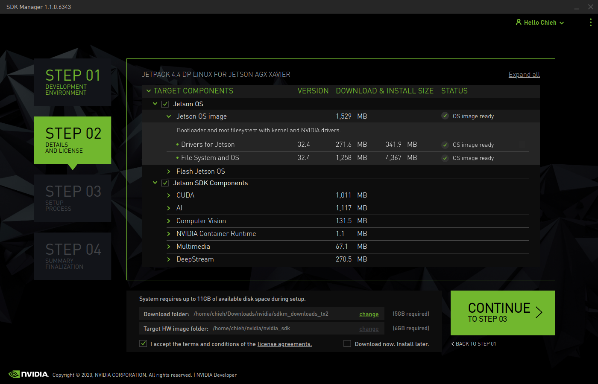
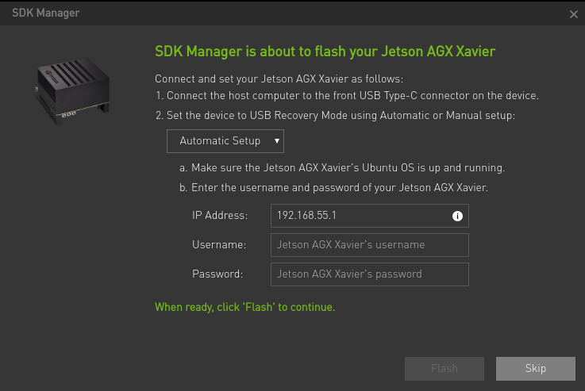

In this page, there is a detail record that how to set up the AGX from scratch.
There are some packages or tools which should be installed.

In my installation, I was installing `JetPack 4.4` and `SDK Manager 1.1.0.6343`. 

# Flash OS and install target components
   1. Go to download the [SDK manager](https://developer.nvidia.com/embedded/jetpack). 
   2. Choose which one `target operating system` you want to install. (JetPack version)
   3. Choose which components you want to install. (I suggest to select whole items.)
   
   We can see that very detail information including version, size and item name.
   4. Go to next step3 to start installing. 
   When we start to download the packages and install. You might meet this prompt below that ask you to type the username and password.
   
   > Press `POWER BUTTON` → Press `RECOVERY BUTTOM` over 3 seconds (Keep hold it) → Press `RESET BUTTON` and unclasp both at the same time.
   You have to login Jetson device to setup until your net can work well. On the other hand, in your host, please type this command `lsusb` on your terminal and check whether there is a `NVIDIA Corp` in the list or not. (Remind: Only one type-c port can connect to PC. So if you cannot find the `NVIDIA Corp`, you can change to another type-c port.)
   5. Come back to step 3. Enter your AGX's username / pd, and then keep going to install.
   6. Done.
   
   After we flashed and installed all components, AGX remained the 16.7GB / 29.5GB space.
   
   Reference:
   - [NVIDIA Jetson TX2學習筆記（一）:安裝JetPack 4.2.1](https://medium.com/@yanweiliu/nvidia-jetson-tx2%E5%AD%B8%E7%BF%92%E7%AD%86%E8%A8%98-%E4%B8%80-3dab5640968e)

   #### Version Information
   There are original versions after we installed the `JetPack 4.4`.
   ```
   TensorRT : 7.1.0.16
   Cmake : 3.10.2
   git version 2.17.1
   Python3 : 3.6.9
   ```

---
# zsh & oh-my-zsh
Commands:
```
sudo apt-get update
sudo apt-get upgrade
sudo apt-get install zsh
```

Use this to check.
```
cat /etc/shells
```

Output:
```
# /etc/shells: valid login shells
/bin/sh
/bin/bash
/bin/rbash
/bin/dash
/bin/zsh
/usr/bin/zsh
nvidia@nvidia-
```

#### Download the `oh-my-zsh`

```
sh -c "$(wget https://raw.githubusercontent.com/robbyrussell/oh-my-zsh/master/tools/install.sh -O -)"
```

#### Change the initial shell of login

```
chsh -s /bin/zsh
```

#### Change the theme

I like this theme, [oh-my-zsh-bunnyruni-theme](https://github.com/jopcode/oh-my-zsh-bunnyruni-theme).

```
cd $ZSH_CUSTOM/themes/
git clone https://github.com/jopcode/oh-my-zsh-bunnyruni-theme.git
mv oh-my-zsh-bunnyruni-theme/bunnyruni.zsh-theme .
```

Set the theme in your `~/.zshrc` file
```
ZSH_THEME="bunnyruni"`
```

Reference:
- [在 Ubuntu 18.04 LTS / 16.04 LTS 中安裝使用 Oh-My-Zsh](https://medium.com/@wifferlin0505/%E5%9C%A8-ubuntu-16-04-lts-%E4%B8%AD%E5%AE%89%E8%A3%9D%E4%BD%BF%E7%94%A8-oh-my-zsh-cf92203ca8a2)

---
# VS code
As the Jetson device is ARM 64 machines, you should build the vs code from source.

```
git clone https://github.com/JetsonHacksNano/installVSCode.git
cd installVSCode
./installVSCode.sh
```

After installation, you can run VSCode by this command.
```
code-oss
```

Reference:
- [Jetson Nano – Visual Studio Code + Python](https://www.jetsonhacks.com/2019/10/01/jetson-nano-visual-studio-code-python/)

#### Install Plugins
1. [Better Comments](https://marketplace.visualstudio.com/items?itemName=aaron-bond.better-comments)
2. [Atom One Dark Theme](https://marketplace.visualstudio.com/items?itemName=akamud.vscode-theme-onedark)
3. [Power Mode](https://marketplace.visualstudio.com/items?itemName=hoovercj.vscode-power-mode)
4. [Python](https://marketplace.visualstudio.com/items?itemName=ms-python.python)
5. [Material Icon Theme](https://marketplace.visualstudio.com/items?itemName=PKief.material-icon-theme)
6. [TODO Highlight](https://marketplace.visualstudio.com/items?itemName=wayou.vscode-todo-highlight)
7. [Markdown All in One](https://marketplace.visualstudio.com/items?itemName=yzhang.markdown-all-in-one)

---
# Install Libraries
```
sudo apt-get install python3-pip
python3 -m pip install --upgrade pip setuptools wheel
sudo -H pip3 install jetson-stats
```

```
sudo apt-get update
sudo apt-get install -y build-essential libatlas-base-dev gfortran libfreetype6-dev python3-setuptools
sudo apt-get install -y protobuf-compiler libprotobuf-dev openssl libssl-dev libcurl4-openssl-dev
```

#### Upgrade Cmake version
(original version is 3.10.2). Follow [here](https://forums.developer.nvidia.com/t/indexerror-list-index-out-of-range-object-detection-and-instance-segmentations-with-a-tensorflow-ma/108306/7?u=chieh).

>cmake version 3.13.0 

```
sudo wget http://www.cmake.org/files/v3.13/cmake-3.13.0.tar.gz
tar xpvf cmake-3.13.0.tar.gz cmake-3.13.0/
cd cmake-3.13.0/
sudo ./bootstrap --system-curl
sudo make -j8
echo 'export PATH=/home/nvidia/cmake-3.13.0/bin/:$PATH' >> ~/.zshrc
source ~/.zshrc
```

#### Install scipy

>scipy version 1.3.3 

```
wget https://github.com/scipy/scipy/releases/download/v1.3.3/scipy-1.3.3.tar.gz
tar -xzvf scipy-1.3.3.tar.gz scipy-1.3.3
cd scipy-1.3.3/
python3 setup.py install --user
```

#### Options

```
sudo apt autoremove
```

---
# Install PyTorch

Please check this [instructions](https://forums.developer.nvidia.com/t/pytorch-for-jetson-nano-version-1-5-0-now-available/72048).

You can also check my [notes](../Pytorch/README.md).

>torch version 1.5.0

```
wget https://nvidia.box.com/shared/static/3ibazbiwtkl181n95n9em3wtrca7tdzp.whl -O torch-1.5.0-cp36-cp36m-linux_aarch64.whl
sudo -H python3 -m pip install Cython
sudo -H python3 -m pip install torch-1.5.0-cp36-cp36m-linux_aarch64.whl
sudo apt-get install python3-pip libopenblas-base libopenmpi-dev 
```

#### Install torchvision

```
sudo apt-get install libjpeg-dev zlib1g-dev
git clone --branch <version> https://github.com/pytorch/vision torchvision
```

>PyTorch v1.5 - torchvision v0.6.0

```
git clone --branch v0.6.0 https://github.com/pytorch/vision torchvision
cd torchvision
sudo -H python3 setup.py install
cd ..
sudo -H python3 -m pip install 'pillow<7' 
```

It installed the version 6.2.2 of pillow in the end.

# Install Onnxruntime

I followed [here](https://github.com/chiehpower/Installation/tree/master/onnxruntime#install-on-agx).

```
git clone --recursive https://github.com/microsoft/onnxruntime && cd onnxruntime
git checkout b783805
export CUDACXX="/usr/local/cuda/bin/nvcc"
```

Modify some places.
```
Modify  tools/ci_build/build.py
    - "-Donnxruntime_DEV_MODE=" + ("OFF" if args.android else "ON"),
    + "-Donnxruntime_DEV_MODE=" + ("OFF" if args.android else "OFF"),
Modify cmake/CMakeLists.txt
    -  set(CMAKE_CUDA_FLAGS "${CMAKE_CUDA_FLAGS} -gencode=arch=compute_50,code=sm_50") # M series
    +  set(CMAKE_CUDA_FLAGS "${CMAKE_CUDA_FLAGS} -gencode=arch=compute_53,code=sm_53") # Jetson support
```

Build it
```
./build.sh --config Release --update --build --build_wheel --use_tensorrt --cuda_home /usr/local/cuda --cudnn_home /usr/lib/aarch64-linux-gnu --tensorrt_home /usr/lib/aarch64-linux-gnu
```
There is an error about cmake. So I tried this.
```
./build.sh
```

(Keep updating...)