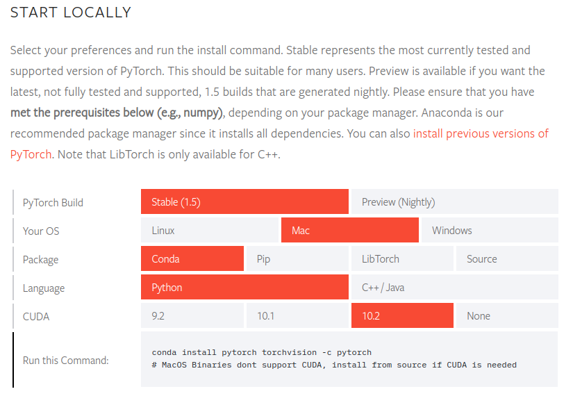

# <center> Install Pytorch </center>

# On AGX

**Source: https://forums.developer.nvidia.com/t/pytorch-for-jetson-nano-version-1-4-0-now-available/72048**
I followed this page to install.
My Jetpack version is 4.3
I am going to install `PyTorch v1.3.0`

### Commands

1. 
```
wget https://nvidia.box.com/shared/static/phqe92v26cbhqjohwtvxorrwnmrnfx1o.whl -O torch-1.3.0-cp36-cp36m-linux_aarch64.whl
```

2. Install this whl file
```
sudo -H python3 -m pip install numpy torch-1.3.0-cp36-cp36m-linux_aarch64.whl
```

3. Install torchvision; so git clone it for my vision. 
They provided us a list.
```
PyTorch v1.0 - torchvision v0.2.2
PyTorch v1.1 - torchvision v0.3.0
PyTorch v1.2 - torchvision v0.4.0
PyTorch v1.3 - torchvision v0.4.2
PyTorch v1.4 - torchvision v0.5.0
```
So we can know that the version should be installed by v0.4.2
```
sudo apt-get install libjpeg-dev zlib1g-dev
git clone --branch v0.4.2 https://github.com/pytorch/vision torchvision
cd torchvision
```

4. Install it.
```
sudo -H python3 setup.py install
```

5. Install pillow
```
sudo -H python3 -m pip install 'pillow<7'
```

### Check

```
>>> import torch
>>> print(torch.__version__)
>>> print('CUDA available: ' + str(torch.cuda.is_available()))
>>> print('cuDNN version: ' + str(torch.backends.cudnn.version()))
>>> a = torch.cuda.FloatTensor(2).zero_()
>>> print('Tensor a = ' + str(a))
>>> b = torch.randn(2).cuda()
>>> print('Tensor b = ' + str(b))
>>> c = a + b
>>> print('Tensor c = ' + str(c))
>>> import torchvision
>>> print(torchvision.__version__)
```

---
# On Desktop

We can directly follow the commands from Pytorch official website.
> https://pytorch.org/get-started/locally/#mac-installation



### Installation
Environmnet setting: 
> OS: Ubuntu 18.04
> CDUA: 10.0
> cuDNN: 7.6.
Version table: 

| torch | torchvision |
|--- | --- |
| 1.5.0 | 0.6.0 |
| 1.4.0 | 0.5.0 |
| 1.3.1 | 0.4.2 |

Install `torch` and  `torchvision`:
```
python3 -m pip install torch==1.4.0 torchvision==0.5.0 -f https://download.pytorch.org/whl/torch_stable.html  
```

*Note : you can also decide the specific cuda version and choose to install the cpu or gpu version. Please follow the instructions of official website.*

For example, my CUDA version is `10.0`.

Command:
```
pip3 install torch==1.4.0+cu100 torchvision==0.5.0+cu100 -f https://download.pytorch.org/whl/torch_stable.html
```

### Uninstall

```
sudo -H python3 -m pip uninstall torch torchvision 
```

### Check 

Use `python3` to check.
The code from [here](https://pytorch.org/get-started/locally/#mac-verification).

```
from __future__ import print_function
import torch
x = torch.rand(5, 3)
print(x)
```

Check the gpu whether it works or not.
```
import torch
torch.cuda.is_available()
```

Should be return `True`
